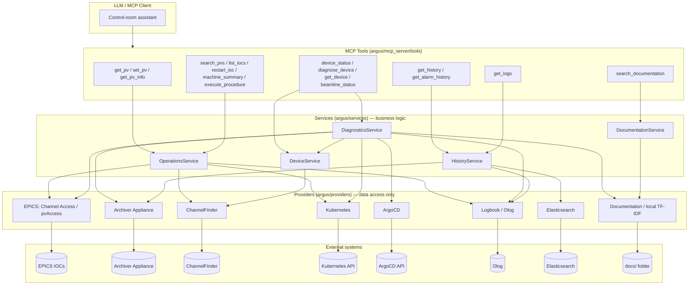

# ARGUS Architecture

ARGUS exposes accelerator control-room operations through a small set of
high-level MCP tools. The LLM calling those tools never knows which backend
system actually answered — that decision lives entirely inside ARGUS.

## Layers



**Providers only retrieve/mutate data.** Every provider implements a small
interface (`is_configured()`, `health()`, plus its domain methods), returns
typed dataclasses (never raw dicts), and raises its own exception hierarchy
rooted in `ArgusError`. When a provider has no configuration it reports
`unconfigured` rather than crashing — see [providers.md](providers.md).

**Services combine providers and hold business logic.** MCP tool handlers are
thin: parse/validate arguments, call one service method, shape the response.
All actual orchestration — which provider to call, in what order, how to
degrade — lives in `argus/services/`.

## Request lifecycle: `diagnose_device()`

This is the flagship flow the architecture is built around — one call that
would otherwise require the operator to separately query EPICS, the
archiver, Kubernetes, ArgoCD, the logbook, and the docs.

```mermaid
sequenceDiagram
    participant LLM
    participant Tool as diagnose_device (tool)
    participant Diag as DiagnosticsService
    participant Dev as DeviceService
    participant CF as ChannelFinder
    participant Fan as gather_with_timeout

    LLM->>Tool: diagnose_device(device_name)
    Tool->>Diag: diagnose_device(device_name)
    Diag->>Dev: resolve_device(device_name)
    Dev->>Dev: cache lookup (device_cache, 300s TTL)
    alt cache miss
        Dev->>CF: find_channels(device=name)
        CF-->>Dev: channels + properties
    end
    Dev-->>Diag: Device (pvs, ioc, pod, namespace, argocd_app, ...)
    Diag->>Fan: fan out to EPICS, Archiver, Kubernetes, ArgoCD, Logbook, Documentation
    Note over Fan: each call wrapped in its own asyncio.wait_for;<br/>exceptions/timeouts become ProviderResult, never raised
    Fan-->>Diag: dict[str, ProviderResult]
    Diag-->>Tool: DiagnosticReport (one structured object)
    Tool-->>LLM: {"status": "success", ...report, "degraded_providers": [...]}
```

If, say, Kubernetes is down, `pod` and `pod_logs` come back with
`status: "unavailable"` while every other section still reports normally —
the LLM gets one coherent, partially-degraded answer instead of a crash.

## Device-centric model

The fundamental ARGUS object is a **Device**, not a PV — see
[ADR 0002](adr/0002-device-metadata-source-of-truth.md). ChannelFinder is the
metadata source of truth; `DeviceService` assembles PVs, IOC, pod, namespace,
git repo, rack, owner, and documentation references from ChannelFinder
properties/tags into one `Device` object that every other service reasons
about.

## Extensibility

New providers (Prometheus, Grafana, InfluxDB, Kafka, OpenSearch, a Digital
Twin, other AI agents) plug in the same way: implement the provider
interface, add settings, register in `AppContext.build()`, and consume it
from whichever service needs it — existing services and tools don't change.
See [developer-guide.md](developer-guide.md).
