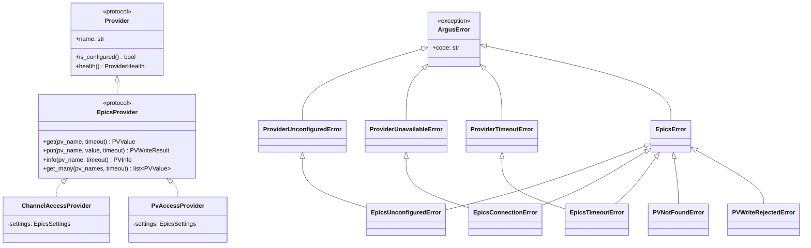
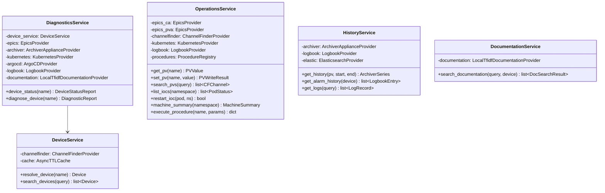
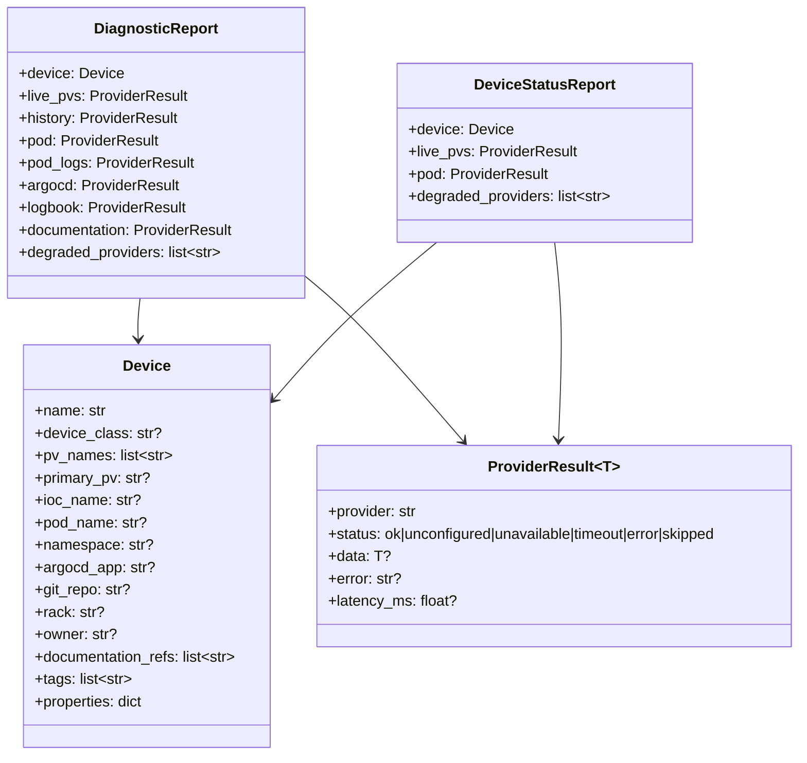

# ARGUS Class Diagrams

## Provider hierarchy (EPICS shown; the same shape repeats for every provider)

Every other provider (`ArchiverError`, `ChannelFinderError`,
`KubernetesError`, `ArgoCDError`, `LogbookError`, `ElasticsearchError`,
`DocumentationError`) follows the identical pattern: a root exception per
provider, with `*UnconfiguredError` / `*UnavailableError` / `*TimeoutError`
subclasses wired into `ProviderUnconfiguredError` / `ProviderUnavailableError`
/ `ProviderTimeoutError` so `gather_with_timeout` can classify any provider's
failure uniformly without knowing which provider it was.

## Services and their provider dependencies

## Core domain models

